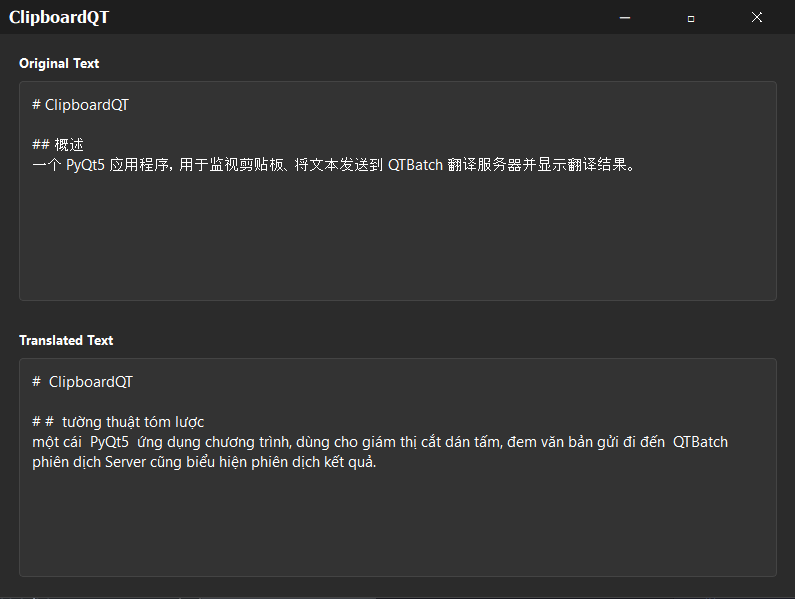

# ClipboardQT


## Overview
ClipboardQT is an advanced clipboard translation application built with PyQt5, designed to provide real-time translation of clipboard contents with a modern, dark-mode UI. the application monitors the clipboard for changes and automatically translates Chinese text to Sino-Vietnamese with the help of QTEngine Server.

## Features
- Real-time clipboard monitoring
- Automatic text translation
- Dark mode support (Windows 10/11)
- Customizable window appearance
- Manual translation trigger
- Windows-native UI enhancements

## Prerequisites
- Python 3.8+
- PyQt5
- requests
- pyperclip
- pywin32

## Installation
```bash
pip install -r requirements.txt
```

## Usage
```bash
python ClipboardQT.py
```

## Configuration
- Translation Server: Configurable in source code
- Monitoring Interval: 1 second (adjustable)
- Dark Mode: Automatic on Windows 10/11
- Minimum Window Size: 400x300 pixels

## System Requirements
- Windows 10 or 11 (recommended)
- Python 3.8+

## Notes
- Requires a running translation server
- Automatically detects clipboard changes
- Supports manual translation initiation

## Version
Current Version: 1.1

## License
[Specify your license here]

## Contributing
[Add contribution guidelines if applicable]
